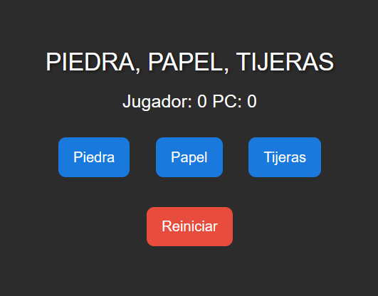

# Juego Piedra Papel o Tijeras

## 📌 Descripción

Aplicación web interactiva desarrollada con React + TypeScript, donde el usuario juega contra la computadora en el clásico juego de Piedra, Papel o Tijera.

El sistema genera una elección aleatoria para la PC y determina el resultado de cada ronda en tiempo real. El marcador se actualiza automáticamente y, al alcanzar 3 victorias, se muestra un modal anunciando al ganador final.

Este proyecto fue inicialmente creado en JavaScript y posteriormente migrado a TypeScript, mejorando el tipado, la escalabilidad y el mantenimiento del código.

## 🌟 Funcionalidades
- 🎮 Juego contra la computadora (selección aleatoria)
- ⚡ Actualización de resultados en tiempo real
- 🧮 Marcador acumulativo
- 🏆 Modal de ganador al llegar a 3 victorias
- 🔄 Migración de JavaScript a TypeScript

## 🛠️ Tecnologías utilizadas
- React
- JavaScript
- CSS
- HTML

## Vista Previa

## 🚀 Instalación y uso
1 Clona el repositorio:
    git clone https://github.com/Vale1702/juego-react.git
    
    cd juego-react
2 Instala las dependencias:
    npm install
3 Inicia el proyecto:
    npm run dev
4 Abre en tu navegador:
    http://localhost:5173

## 🎮 Cómo jugar
- Selecciona una opción: Piedra, Papel o Tijera.
- La computadora elegirá una opción aleatoria.
- Se mostrará el resultado de la ronda:
    - ✅ Ganas
    - ❌ Pierdes
    - ➖ Empate
- El marcador se actualizará automáticamente.
- El primero en llegar a 3 victorias gana la partida.

## 📈 Mejoras futuras
🎨 Animaciones en las elecciones
🌐 Modo multijugador
📱 Mejoras en diseño responsive